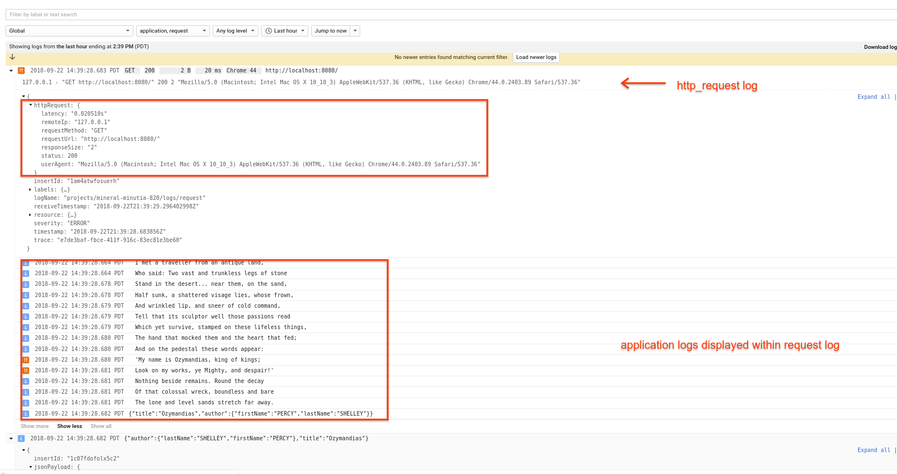

# Django Middleware for grouped log lines for Google Cloud Logging

Django middleware that allows log lines emitted within a request handler to display/render together.
At the moment, this is designed entirely with AppEngine in mind.

- [https://pypi.org/project/flask-gcp-log-groups/](https://pypi.org/project/flask-gcp-log-groups/)

This project was forked from https://github.com/salrashid123/flask-gcp-log-groups
Would like to say a massive thanks to salrashid123, without whose work I would not been able to do this.

Normally, when using Google Cloud Logging libraries ([google-cloud-logging](https://pypi.org/project/google-cloud-logging/) and [CloudLoggingHander](https://googlecloudplatform.github.io/google-cloud-python/latest/logging/handlers.html)), each log entry that gets emitted is displayed separately within the Logging UI.  However, its desireable to group all logs together that logically belong that way in an HTTP Request.  For a given HTTP Request into Django, this extension displays all the logs 'together' below the parent request.

For example, all log lines will appear under one top-level HTTP Request within [Google Cloud Logging](https://cloud.google.com/logging/) as in:

- 

Note, that the application log entry does appear in the unfiltered logs still but users will 'see' all the log lines associated with the parent http_request.

What makes this possible is attaching the `traceID` field to each application log entry as well as emitting the parent `http_request`.  Google cloud logging will use the traceID and "collapse" them together.

---

## Usage

To use this, you need a Google Cloud Platform project first. At the moment, only AppEngine is supported.

Install [gcloud sdk](https://cloud.google.com/sdk/docs/quickstarts) to test locally or run in an envionment where [Application Default Credentials](https://cloud.google.com/docs/authentication/production#obtaining_credentials_on_compute_engine_kubernetes_engine_app_engine_flexible_environment_and_cloud_functions) is setup.

A trace header value must also get sent into the Django request. Google Cloud automatically sends in a trace header though any system that proxies an L7 loadbalancer.  For example, `X-Cloud-Trace-Context` header is sent in for App Engine, Compute Engine L7 HTTP LB and in Kubernetes Ingress constructs.


Configuration Parameters

There is currently no configuration available. The logger takes the project id from the current environment.

Once the logging handler is initialized, you can directly emit either a ```text_payload``` or ```json_payload``` as shown above.  The JSON payload allows for easy filtering on GCP logging console.

The logging handler will aggregate the applicaiton logs and tag the top-level request log with the the highest priority.  That is, if any app log is emitted at level `ERROR`, then the overall aggregated request log will acquire that level.


## Quickstart

```
virtualenv env
source env/bin/activate
pip install django-gcp-log-groups

wget https://raw.githubusercontent.com/salrashid123/flask-gcp-log-groups/master/testing/main.py

python main.py
```

then in a new window

```
curl -v  -H "User-Agent: Mozilla/5.0 (Macintosh; Intel Mac OS X 10_10_3) AppleWebKit/537.36 (KHTML, like Gecko) Chrome/44.0.2403.89 Safari/537.36" \
    -H "X-Cloud-Trace-Context: `python -c "import uuid; print uuid.uuid4()"`" \
    http://localhost:8080/
```

## Viewing logs

If the flask app is deployed behind a GCP Loadbalancer that automatically emits ```X-Cloud-Trace-Context```, you can view the collapsed logs in cloud logging
under ```Cloud Logging >> Global``` filter on the GCP Console.

>> Note: logs display on GCP Cloud Console under `global` will show _all_ logs in one set together.

---

## Sample Usage
In your django settings file, update the MIDDLEWARE list, add the following
```python
    'django_gcp_log_groups.GCPLoggingMiddleware',
    'django.middleware.http.ConditionalGetMiddleware',
```
To avoid logging to GCP in a local or test environment, you can 

## References

  - [google.cloud.logging.handlers.handlers.CloudLoggingHandler](https://googlecloudplatform.github.io/google-cloud-python/latest/logging/handlers.html)
  - [Combining correlated Log Lines in Google Stackdriver](https://medium.com/google-cloud/combining-correlated-log-lines-in-google-stackdriver-dd23284aeb29)
  - [Blog: Alex Van Boxel's Cloud Logging though a Python Log Handler](https://medium.com/google-cloud/cloud-logging-though-a-python-log-handler-a3fbeaf14704)
